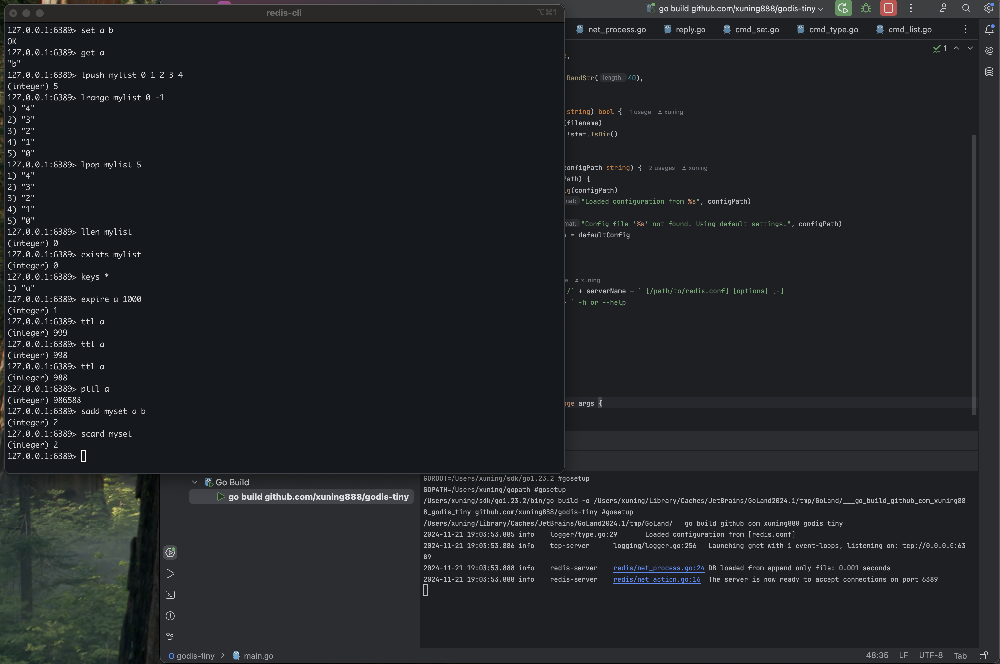

# godis-tiny - 用 Go 实现的 Redis 服务器

## 简介
godis-tiny 是一个用 Go 语言实现的简化版 Redis 服务器。我创建这个项目是为了了解 Redis 服务器的实现原理和提高自己的 Go 语言编程技能。



## 开始
```shell
go run main.go
```

## 当前已实现的功能

- **命令处理**：采用单线程处理方式，简化了线程安全问题和锁机制。
- **过期键处理**：使用按过期时间排序的优先队列替代传统的时钟轮，结合定时清理和主动随机清理来管理过期键。
- **网络库**：集成使用 [gnet](https://github.com/panjf2000/gnet) 提供高性能的网络处理。
- **AOF 及 AOF 重写**：支持追加文件（Append-Only File）日志和后台重写功能。

## 已实现的命令

- **键值命令**：
    - `set key value`：设置键的值。
    - `get key`：获取指定键的值。
    - `del key`：删除指定的键。
    - `exists key`：检查键是否存在。
    - `getset key`：设置新值并返回旧值。
    - `strlen key`：获取键对应值的字符串长度。
    - `keys pattern`：查找符合模式的键。
    - `getdel key`：获取并删除键。
    - `incr key`：自增键的值。
    - `decr key`：自减键的值。
    - `incrby key step`：增加键的值。
    - `decrby key step`：减少键的值。
    - `mget [key...]`：同时获取多个键的值。
    - `mset pairs`：同时设置多个键值对。
    - `getrange key start end`：获取值中指定范围的子字符串。

- **列表命令**：
    - `lpush key [elements]`：从左侧推入元素到列表。
    - `rpush key [elements]`：从右侧推入元素到列表。
    - `lpop key count`：从左端弹出指定数量的元素。
    - `rpop key count`：从右端弹出指定数量的元素。
    - `lrange key start end`：获取列表指定范围内的元素。
    - `llen key`：获取列表的长度。
    - `lindex key index`：获取列表中指定索引的元素。

- **哈希命令**：
    - `hset key field value`：设置哈希表的字段值。
    - `hget key field`：获取哈希表指定字段的值。

- **集合命令**：
    - `sadd key member`：向集合添加成员。
    - `smembers key`：返回集合中的所有成员。
    - `scard key`：获取集合的成员数量。

- **持久化和维护命令**：
    - `bgrewriteaof`：后台 AOF 重写。
    - `flushdb`：刷新数据库。
    - `ttl key`：获取键的剩余生存时间。
    - `pttl key`：获取键的剩余生存时间（毫秒）。
    - `expire key seconds`：设置键的过期时间（秒）。
    - `persist key`：移除键的过期时间。
    - `expireat key`：在指定时间点让键过期。

- **其他命令**：
    - `ping [message]`：测试连接或发送响应信息。
    - `select db`：选择数据库。
    - `type key`：返回键的类型。
    - `ttlops`：内部命令，触发ttl
    - `quit`：退出客户端连接。
    - `memory`：查看键占用的内存。
    - `info`：提供服务器信息的部分实现。
    - `gc`：尝试触发垃圾回收。

## 计划实现的功能
- **RDB 持久化**：实现 Redis 数据库文件持久化功能。
- **主从复制模式**：探索和实现 Redis 的主从复制。

## 支持的操作系统
- **Linux**
- **macOS**
- **Windows**：注意 `gnet` 对 Windows 的支持尚不完全，可能影响性能。

## 致敬
- 向 [HDT3213 的 godis](https://github.com/HDT3213/godis) 表示感谢。
- 向 [panjf2000 的 gnet](https://github.com/panjf2000/gnet) 表示感谢。